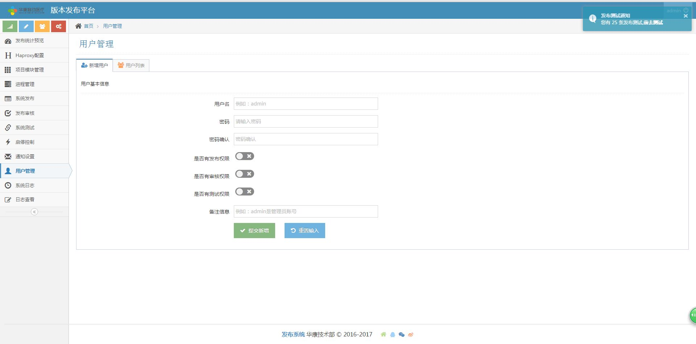

# 版本发布系统 V1.0#

## 系统介绍 ##

华康版本发布平台是华康运维组实现自动化运维管理流程的重要一环，其主要解决的问题是研发部门频繁的业务代码更新需求，实现对版本发布的申请审核、发布质量的监控，以及测试结果的确认，通过版本发布平台，可以获取到整个研发项目组的发布情况、发布质量等指标，后续将监控级别完善至代码级别，监测新旧版本的响应时间，实现最直观的版本质量监控展示图表。

## 功能介绍 ##

华康版本发布平台底层采用开源运维工具Ansible进行通信与管理，其配置管理基于CMDB系统，是集成了Haproxy配置、模块配置、进程管理、版本发布、审批、测试与通知、日志审计、权限管理、用户管理等功能模块的综合性系统版本发布平台。该版本平台采用B/S架构，前端提供web界面，直观的提供界面展示与操作交互；

#### 首页展示 ####

区域说明：

区域一：
页面标题区域，左侧为公司logo与发布系统名称，右侧为当前登录用户账号与注销按钮。

区域二：
	左侧导航栏，普通账号有发布预览、系统发布、发布审核、启停控制、系统测试与日志查看六个导航选项，管理员账号（admin）默认具备普通账号所有导航选项以外，还增加了Haproxy配置、项目模块管理、系统日志与通知设置四个导航模块。

区域三：
	面包屑导航。

区域四：
	通知弹窗区域，该区域会针对当前用户进行审核/测试消息的通知弹窗。

区域五：
	区域五为主显示区域，目前功能正在开发。

区域六：
	本区域目前展示的内容为最近一周内，四个开发组的每日发布数量的统计折线图，反应的时候不同项目组的发布活跃度。

区域七：
	区域展示的最近一周内，状态为启用的模块的发布情况（蓝色代表通过审核，红色代表未通过审核）。

区域八：
	展示的是当前系统中最近五次审核完成后的发布申请，不包含正在审核流程的发布申请。

区域九：
网站版权声明栏

#### 项目管理 ####

展示所有服务器信息，实现实时获取服务器系统详情

目前的项目管理模块，主要实现服务器与模块之间的对应关系，通过新增服务器可以实现宿主机系统与服务器的SSH免秘钥登陆（只基于fabu账号）；通过新增模块则建立服务器与模块之间的对应关系，该关系对应的是底层ansible hosts，通过web前端对数据库的操作，同步操作于ansible hosts文件上，实现对hosts文件的增删改。

#### 进程管理 ####

进程管理模块是对当前系统中所配置的模块在对应服务器上的点对点呈现，其展示的是根据模块，在模块对应的设备上，检测出tomcat_模块名为关键字的进程信息，直观的展示当前模块的运行情况（PID、占用CPU内存、持续时间、状态等），系统后台默认每5分钟执行一次进程信息获取，并更新于数据库，默认保留6小时内的数据。

#### 系统发布 ####

发布系统模块是整个发布系统的发起部分，其主要功能就是发布者通过上传指定格式的压缩包至系统后台，然后将需要进行发布的主机与发布详情等提交与指定的审核人，由审核人对发布申请进行审核，通过即触发版本发布动作。

部署类型：
必选项，默认增量部署。
当前系统分为两种类型：全新部署与增量部署，全新部署是指将原有部署服务器上的相关tomcat目录全部删除，增量部署即是覆盖更新。

压缩文件：
必选项。拉框只对已上传的tomcat压缩包进行可选
MD5值：
必填项。需要进行发布的tomcat压缩包的MD5值，验证上传过程中压缩包是否受损。

发布审核人：
必选项。选择你需要进行对本次发布进行审核的人员。
--说明：该字段不建议选择自己作为审核人

项目模块：
必填项。压缩包与模块一一对应。

发布详情：
必填项，支持富文本。

#### 发布审核 ####

发布审核模块是发布系统中最重要的一环，当前用户可以获取到三项数据：

我的发布：即是由我发起的发布申请（可以查看详情或者取消发布）
我的审核：即是由申请人指定由我来进行审核与发布的申请
审核完成：由审核已通过与审核不通过两部分组成

点击‘我的审核’，即可展示所有提交给‘我’来进行审核的发布申请。

#### 系统测试 ####

版本发布完成以后，即自动进入到对该版本进行测试流程，由测试人员开始处理流程。
测试管理页面首页统计发布申请总数、待测试以及测试通过等数量，便于相关人员进行系统测试的统计工作。

#### 用户管理 ####
该模块对登录到系统进行操作（发布、审批、测试等）的用户进行管理，可以对用户进行增删改查，对用户使用状态与权限进行控制。

#### 系统日志 ####

系统日志模块当前只会记录登录日志与操作日志，其中登录日志，只记录账号的登录时间与登出时间，操作日志则记录用户的发起申请、取消申请、审批、测试等操作内容。

## 安装部署 ##

见document目录中UserDoc手册
 

